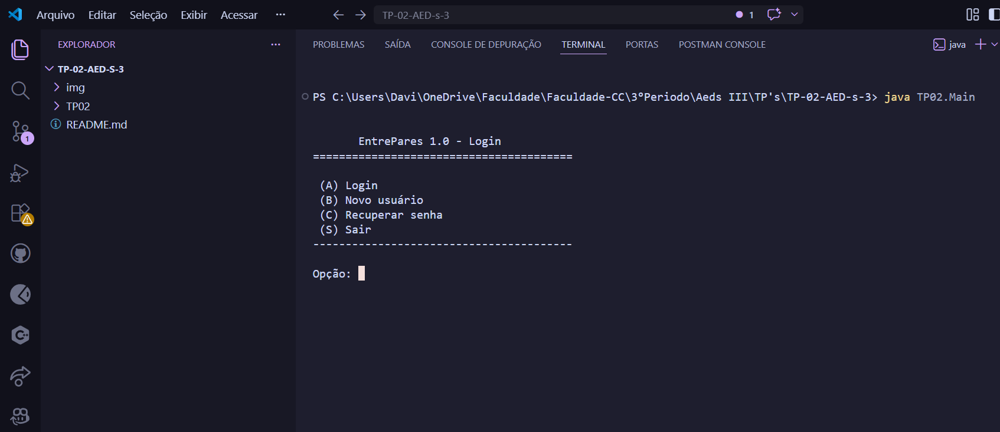
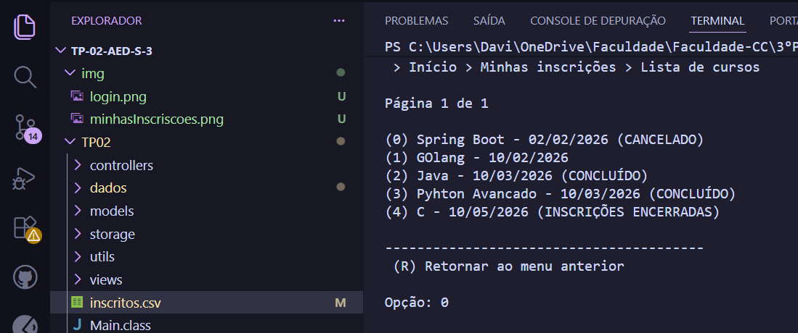
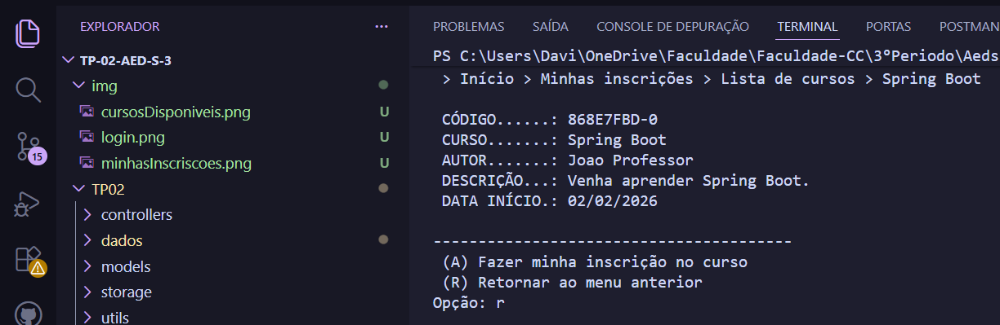
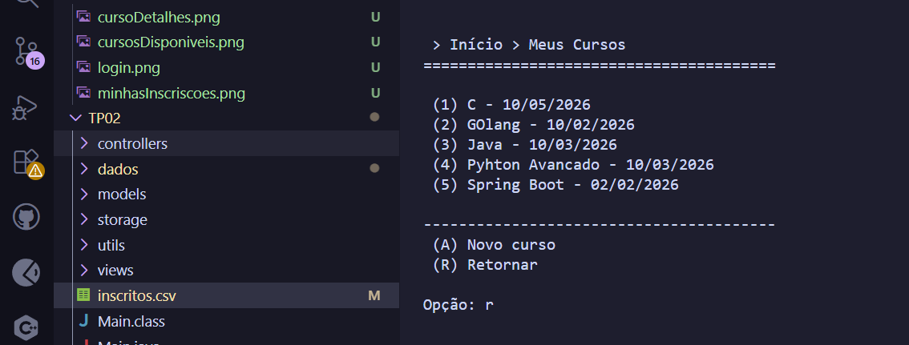
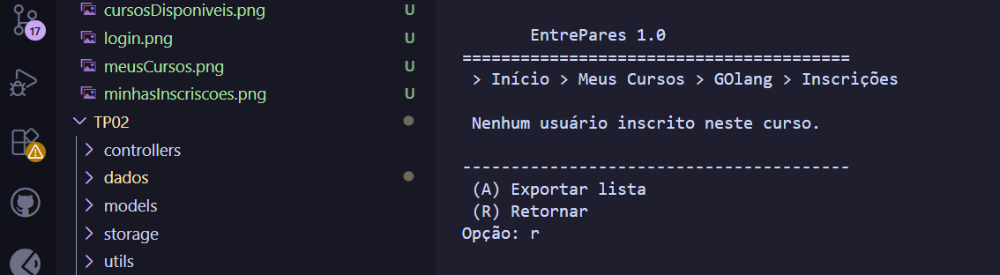

# Relatorio do Trabalho Pratico 02 - AEDS III

Link do Video Da Plataforma no Youtube: [TP02-AEDS 3](https://youtu.be/JTHIV_Fhdbs) 

## Participantes

- Davi Rafael de Oliveira Gurgel Martins:
- Pedro Augusto Gomes de Araújo

## Descricao geral do sistema

O sistema desenvolvido e uma aplicacao Java em modo console chamada `EntrePares 1.0`, voltada para o gerenciamento de usuarios, cursos e inscricoes em cursos. A proposta principal do trabalho e permitir que usuarios cadastrem cursos, divulguem esses cursos por meio de um codigo compartilhavel e que outros usuarios possam localizar esses cursos e realizar inscricoes.

O projeto segue uma organizacao em camadas, separando modelos, armazenamento, regras de controle e visoes de tela. A classe `Main` inicializa os objetos principais do sistema, instancia as visoes, os arquivos de armazenamento e os controladores, alem de injetar as dependencias entre cursos, usuarios e inscricoes.

O sistema permite:

- cadastrar, autenticar, editar, recuperar senha e excluir usuarios;
- cadastrar cursos associados ao usuario logado;
- listar e gerenciar os cursos criados pelo usuario;
- alterar dados, data e estado de um curso;
- buscar cursos de outros usuarios por codigo compartilhavel;
- listar cursos disponiveis de outros usuarios;
- realizar inscricoes em cursos;
- listar as inscricoes feitas pelo usuario;
- cancelar inscricoes;
- gerenciar os usuarios inscritos em um curso criado pelo usuario;
- exportar a lista de inscritos de um curso para arquivo CSV;
- manter indices em arquivos usando Hash Extensivel e Arvore B+.

## Classes criadas

### Classe principal

- `TP02.Main`

### Models

- `TP02.models.Registro`
- `TP02.models.Usuario`
- `TP02.models.Curso`
- `TP02.models.CursoUsuario`

### Controllers

- `TP02.controllers.ControleUsuario`
- `TP02.controllers.ControleCurso`
- `TP02.controllers.ControleInscricao`

### Views

- `TP02.views.VisaoUsuario`
- `TP02.views.VisaoCurso`
- `TP02.views.VisaoInscricao`
- `TP02.views.VisaoInscritos`

### Storage e indices

- `TP02.storage.Arquivo`
- `TP02.storage.ArquivoUsuario`
- `TP02.storage.ArquivoCurso`
- `TP02.storage.ArquivoInscricao`
- `TP02.storage.HashExtensivel`
- `TP02.storage.ArvoreBMais`
- `TP02.storage.RegistroHashExtensivel`
- `TP02.storage.RegistroArvoreBMais`
- `TP02.storage.ParIDEndereco`
- `TP02.storage.ParEmailID`
- `TP02.storage.ParCodigoID`
- `TP02.storage.ParUsuarioCurso`
- `TP02.storage.ParCursoID`
- `TP02.storage.ParUsuarioID`

### Testes utilitarios

- `TP02.utils.TesteUsuario`
- `TP02.utils.TesteCurso`

## Organizacao dos dados

Os dados sao armazenados em arquivos binarios no diretorio `TP02/dados`. Cada entidade principal possui seu proprio arquivo de dados e arquivos auxiliares de indice.

Usuarios:

- arquivo principal: `TP02/dados/usuarios/usuarios.db`;
- indice direto por ID: `usuarios.d.db` e `usuarios.c.db`;
- indice indireto por e-mail: `indiceEmail.d.db` e `indiceEmail.c.db`.

Cursos:

- arquivo principal: `TP02/dados/cursos/cursos.db`;
- indice direto por ID: `cursos.d.db` e `cursos.c.db`;
- indice indireto por codigo compartilhavel: `indiceCodigo.d.db` e `indiceCodigo.c.db`;
- Arvore B+ para associar usuario e curso: `arvoreCursos.db`.

Inscricoes:

- arquivo principal: `TP02/dados/inscricoes/inscricoes.db`;
- indice direto por ID: `inscricoes.d.db` e `inscricoes.c.db`;
- Arvore B+ por curso: `arvoreCurso.db`;
- Arvore B+ por usuario: `arvoreUsuario.db`.

## Funcionamento das principais entidades

### Usuario

A entidade `Usuario` representa uma pessoa cadastrada no sistema. Ela possui ID, nome, e-mail, hash da senha, pergunta secreta e hash da resposta secreta. O controle de usuarios permite cadastro, login, edicao de dados, alteracao de senha, recuperacao de senha e exclusao da conta.

O e-mail e indexado por Hash Extensivel, permitindo localizar rapidamente um usuario pelo e-mail durante o login e a recuperacao de senha.

### Curso

A entidade `Curso` representa um curso cadastrado por um usuario. Ela possui ID, nome, data de inicio, descricao, codigo compartilhavel, estado e ID do usuario criador.

Os estados implementados sao:

- `ATIVO_INSCRICOES`: curso ativo e recebendo inscricoes;
- `ATIVO_SEM_INSCRICOES`: curso ativo, mas sem aceitar novas inscricoes;
- `CONCLUIDO`: curso finalizado;
- `CANCELADO`: curso cancelado.

Cada curso recebe um codigo compartilhavel gerado automaticamente. Esse codigo funciona como o NanoID exigido no trabalho, permitindo que outros usuarios encontrem o curso diretamente.

### CursoUsuario

A entidade `CursoUsuario` representa a associacao N:N entre usuarios e cursos. Cada registro possui:

- ID proprio da inscricao;
- ID do curso;
- ID do usuario;
- data da inscricao.

Essa classe e armazenada pelo `ArquivoInscricao`, que implementa as operacoes de criacao, leitura e exclusao das inscricoes, alem de consultas por curso e por usuario.

## Operacoes especiais implementadas

### Hash Extensivel como indice direto

A classe generica `Arquivo<T>` usa `HashExtensivel<ParIDEndereco>` como indice direto. Esse indice associa o ID de cada registro ao endereco fisico do registro no arquivo binario. Isso evita a necessidade de percorrer todo o arquivo para localizar um registro por ID.

### Reaproveitamento de espaco com lapides

Os registros removidos sao marcados com lapide (`*`) e seus espacos entram em uma lista de removidos. Ao criar ou atualizar registros, o sistema tenta reaproveitar esses espacos antes de gravar no final do arquivo.

### Indice por e-mail

A classe `ArquivoUsuario` usa `HashExtensivel<ParEmailID>` para associar o e-mail do usuario ao seu ID. Isso e usado principalmente no login, recuperacao de senha e exclusao por e-mail.

### Indice por codigo compartilhavel do curso

A classe `ArquivoCurso` usa `HashExtensivel<ParCodigoID>` para associar o codigo compartilhavel do curso ao ID do curso. Essa estrutura permite a busca direta de cursos por codigo.

### Arvore B+ para cursos por usuario

A classe `ArquivoCurso` usa uma `ArvoreBMais<ParUsuarioCurso>` para relacionar o ID do usuario criador com os IDs dos cursos criados por ele. Isso permite listar os cursos pertencentes ao usuario logado.

### Duas Arvores B+ para inscricoes

A classe `ArquivoInscricao` usa duas arvores B+:

- `ArvoreBMais<ParCursoID>`: permite encontrar as inscricoes de um determinado curso;
- `ArvoreBMais<ParUsuarioID>`: permite encontrar as inscricoes de um determinado usuario.

Essa solucao atende ao relacionamento N:N, pois permite consultar a associacao nos dois sentidos: cursos de um usuario e usuarios inscritos em um curso.

### Integridade das inscricoes

O sistema impede que um usuario se inscreva em um curso proprio. Tambem verifica se o curso esta com inscricoes abertas antes de permitir a inscricao. Alem disso, verifica se o usuario ja esta inscrito no curso, evitando inscricoes duplicadas.

### Gestao de inscritos pelo criador do curso

Na visao de cursos, o usuario criador pode abrir a lista de inscritos de um curso, visualizar os dados dos inscritos, cancelar uma inscricao e exportar a lista de inscritos para CSV.

### Exportacao para CSV

A classe `ControleCurso` possui a operacao de exportacao da lista de inscritos para o arquivo `TP02/inscritos.csv`. O arquivo contem, pelo menos, nome e e-mail dos usuarios inscritos.

### Ordenacao e paginacao

Na visao de inscricoes, a listagem geral de cursos apresenta paginacao de 10 itens por pagina. Os cursos sao ordenados por data de inicio. Na visao de cursos do usuario, os cursos sao ordenados alfabeticamente.

## Telas do sistema

As capturas abaixo devem ser inseridas no relatorio final entregue ao professor. Elas foram escolhidas por mostrarem as funcionalidades principais do TP02.

### Figura 1 - Menu inicial


### Figura 2 - Menu principal apos login



### Figura 3 - Tela de minhas inscricoes


### Figura 4 - Lista de cursos disponiveis



### Figura 5 - Detalhes de curso para inscricao



### Figura 6 - Meus cursos



### Figura 7 - Gerenciamento de inscritos



## Checklist obrigatorio

**Ha um CRUD da entidade de associacao CursoUsuario (que estende a classe ArquivoIndexado, acrescentando Tabelas Hash Extensiveis e Arvores B+ como indices diretos e indiretos conforme necessidade) que funciona corretamente?**

Sim, com ressalva de nomenclatura. A entidade de associacao foi implementada como `CursoUsuario`, e seu armazenamento foi implementado em `ArquivoInscricao`, que estende a classe generica `Arquivo<CursoUsuario>`. No projeto, a classe base se chama `Arquivo`, nao `ArquivoIndexado`. Ela possui indice direto com Hash Extensivel por ID e o `ArquivoInscricao` acrescenta duas Arvores B+ para consultas por curso e por usuario. As operacoes implementadas incluem criar inscricao, ler por ID, listar por curso, listar por usuario, listar todas, verificar duplicidade e excluir inscricao.

**A visao de inscricoes esta corretamente implementada e permite consultas aos cursos em que um usuario esta inscrito?**

Sim. A classe `VisaoInscricao`, junto com `ControleInscricao`, mostra as inscricoes do usuario logado, permite consultar detalhes de um curso inscrito e permite cancelar a inscricao. As consultas sao feitas a partir da Arvore B+ por usuario em `ArquivoInscricao.readByUsuario`.

**A visao de cursos funciona corretamente e permite a gestao dos usuarios inscritos em um curso?**

Sim. A classe `VisaoCurso`, junto com `ControleCurso` e `VisaoInscritos`, permite ao criador do curso visualizar seus cursos, selecionar um curso, gerenciar inscritos, ver detalhes de inscritos, cancelar inscricoes e exportar a lista de inscritos em CSV.

**Ha uma visualizacao dos cursos de outras pessoas por meio de um codigo NanoID?**

Sim. O sistema gera um codigo compartilhavel para cada curso na classe `Curso`. Esse codigo e usado como identificador semelhante ao NanoID. A busca por codigo e implementada em `ControleInscricao.buscarPorCodigo`, usando o metodo `ArquivoCurso.read(String codigoCompartilhavel)` e o indice `HashExtensivel<ParCodigoID>`.

**A integridade do relacionamento entre cursos e usuarios esta mantida em todas as operacoes?**

Sim, com observacoes. O sistema mantem a integridade principal do relacionamento N:N: nao permite inscricao em curso proprio, nao permite inscricao duplicada, so permite inscricao quando o curso esta aberto, remove os indices das arvores ao cancelar uma inscricao e impede excluir usuario que possui inscricoes ou cursos ativos. Tambem remove cursos concluidos ou cancelados ao excluir conta. Uma observacao e que algumas consultas filtram resultados apos ler todos os pares da Arvore B+, em vez de buscar diretamente pela chave especifica, o que funciona, mas nao e a forma mais eficiente.

**O trabalho compila corretamente?**

Sim. O projeto foi compilado com o comando:

```bash
javac TP02\Main.java TP02\models\*.java TP02\storage\*.java TP02\controllers\*.java TP02\views\*.java TP02\utils\*.java
```

A compilacao terminou sem erros.

**O trabalho esta completo e funcionando sem erros de execucao?**

Sim, considerando as funcionalidades principais exigidas para o TP02. O sistema possui cadastro/login de usuarios, criacao e gerenciamento de cursos, busca por codigo, listagem de cursos, inscricoes, cancelamento, gestao de inscritos e exportacao CSV. Ha uma opcao de busca por palavras-chave marcada como funcionalidade em desenvolvimento, o que esta de acordo com a especificacao, pois essa busca ficou prevista para o TP03.

**O trabalho e original e nao a copia de um trabalho de outro grupo?**

Sim. O trabalho foi desenvolvido pelo grupo, com classes proprias para modelos, controladores, visoes e armazenamento, utilizando as estruturas de dados exigidas na disciplina.

## Conclusao

O trabalho implementa o relacionamento N:N entre usuarios e cursos por meio da entidade `CursoUsuario`, armazenada em arquivo proprio e indexada por Hash Extensivel e Arvores B+. O sistema permite que usuarios criem cursos, que outros usuarios encontrem esses cursos por codigo compartilhavel ou listagem, realizem inscricoes e consultem suas inscricoes. Tambem permite que o criador do curso gerencie os inscritos e exporte a lista para CSV.

